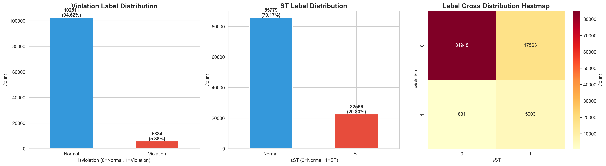
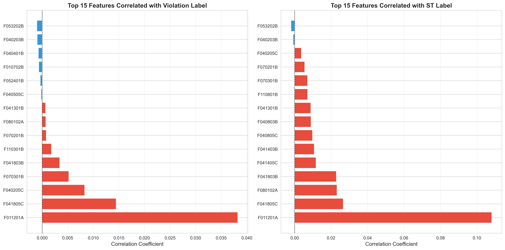
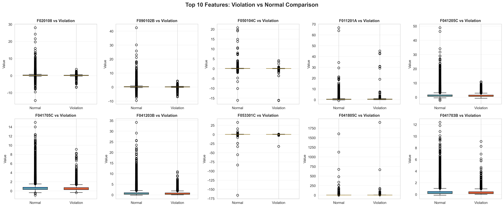

<p align="center">
  
  <br/>
  <br/>
</p>

<p align="center">
    <a href="https://github.com/HIT-JimmyXiao/Financial_Fraud_Detection_Implementation_Project/blob/main/LICENSE"></a>
    <a href="https://github.com/HIT-JimmyXiao/Financial_Fraud_Detection_Implementation_Project/releases"></a>
    <a href="https://pandas.pydata.org/"></a>
    <a href="https://python.org/"></a>
</p>

<h4 align="center">
    <p>
        <b>简体中文</b> |
        <a href="https://github.com/HIT-JimmyXiao/Financial_Fraud_Detection_Implementation_Project/blob/main/README_en.md">English</a>
    </p>
</h4>

## 📋 项目概述

本项目是针对中国A股市场（2007-2022年）的财务舞弊识别研究项目。基于舞弊三角理论（压力、机会、借口），通过数据预处理、特征工程、模型训练等步骤，构建财务舞弊识别系统。

**实验组**：Group ID = 13

**核心特点**：
- 季度去重：按月份识别季度（3、6、9、12月）
- Typrep优先：优先保留A类型（合并报表），无A才保留B类型（母公司报表）
- 数据质量：避免同一季度重复数据，确保数据完整性

## 🎯 项目目标

- **数据预处理**：对多源财务数据进行集成、清洗、变换和标注
- **特征工程**：基于舞弊三角理论构建特征体系
- **模型训练**：训练机器学习模型识别财务舞弊
- **结果分析**：分析模型性能和改进方向

## ✨ 项目特点

- **理论基础**：基于舞弊三角理论（压力、机会、借口）构建特征体系
- **多源数据集成**：整合8个财务主题表（偿债能力、经营能力、盈利能力等）和违规信息表
- **完整流程**：从数据预处理到模型训练的完整pipeline
- **质量保证**：完整的数据质量校验和模型评估流程

## 🔍 项目结构

```
Financial_Fraud_Detection_Implementation_Project/
├── Dataset/                      # 原始数据集目录
│   ├── 偿债能力/                 # FI_T1.xlsx - 偿债能力指标（含Indcd）
│   ├── 经营能力/                 # FI_T4.xlsx - 经营能力指标
│   ├── 盈利能力/                 # FI_T5.xlsx - 盈利能力指标
│   ├── 发展能力/                 # FI_T8.xlsx - 发展能力指标
│   ├── 风险水平/                 # FI_T7.xlsx - 风险水平指标
│   ├── 披露财务指标/             # FI_T2.xlsx - 披露财务指标
│   ├── 每股指标/                 # FI_T9.xlsx - 每股指标
│   ├── 股利分配/                 # FI_T11.xlsx - 股利分配指标
│   ├── 违规信息总表/             # STK_Violation_Main.xlsx - 违规标注数据源
│   └── 集成数据示例.csv          # 参考示例
│
├── Insight_output/               # 输出目录
│   ├── 13-preprocessed.csv       # ✅ 预处理数据（108,345行×47列，Group ID=13，季度去重策略）
│   ├── 13-preprocessed_final.csv # ✅ 深度清理后数据（108,345行×40列，34个特征，VIF过滤后）
│   ├── deep-cleaning.py          # 深度数据清理脚本（方差过滤+VIF共线性过滤）
│   ├── deep-cleaning-report.txt  # 深度清理报告
│   ├── preprocess_log_balanced.txt  # 处理日志
│   ├── 质量报告_最终版.md        # 数据质量报告
│   ├── 完成总结_最终版.md        # 任务完成总结
│   └── data-analysis/            # 数据分析目录
│       ├── 数据分析报告.ipynb    # 完整EDA分析报告
│       ├── label_distribution.png # 标签分布图
│       ├── correlation_heatmap.png # 特征相关性热力图
│       ├── feature_label_correlation.png # 特征-标签相关性图
│       ├── violation_comparison_boxplot.png # 违规/正常组对比箱线图
│       └── feature_pairplot.png   # 特征配对图
│
├── model/                        # 模型训练目录（核心内容）
│   ├── models/                   # 模型定义
│   ├── test/                     # 模型测试脚本
│   └── results/                   # 模型结果
│
├── preprocess_data_balanced.py   # ✅ 推荐使用的预处理脚本（三键策略）
├── preprocess_data_tiny_version.py  # 简化版预处理脚本（二键策略）
├── 数据预处理步骤指南.ipynb      # Jupyter Notebook逐步执行指南
├── taskmap.md                    # 任务指导清单与顺序
├── README.md                     # 本文件（中文版）
└── README_en.md                  # 英文版README
```

## 🚀 快速开始

### 安装依赖

```bash
pip install pandas numpy openpyxl scikit-learn matplotlib seaborn
```

### 阶段1：数据预处理

```bash
# 步骤1：基础预处理（季度去重策略，Group ID=13）
python preprocess_data_balanced.py

# 步骤2：深度数据清理（方差过滤+VIF共线性过滤）
cd Insight_output
python deep-cleaning.py

# 或使用Jupyter Notebook逐步执行
jupyter notebook 数据预处理步骤指南.ipynb
```

### 输出文件位置

运行成功后，预处理数据将保存在：
- **基础预处理**：`Insight_output/13-preprocessed.csv`（108,345行×47列，Group ID=13，季度去重策略）
- **深度清理后**：`Insight_output/13-preprocessed_final.csv`（108,345行×40列，34个特征，VIF过滤后）
- **日志**：`Insight_output/preprocess_log_balanced.txt`
- **清理报告**：`Insight_output/deep-cleaning-report.txt`
- **质量报告**：`Insight_output/质量报告_最终版.md`
- **完成总结**：`Insight_output/完成总结_最终版.md`

**说明**：
- 使用季度去重策略（Group ID=13）
- 对于同一公司同一季度，优先保留A类型（合并报表）
- 自动过滤非A/B类型的报表

### 深度数据清理详情

**处理流程**：
1. **缺失值分层处理**：
   - 删除缺失率>50%的列（F110101B: 82.56%）
   - KNN填充缺失率<30%的列（40个特征，k=5，分批处理显示进度）
   - Indcd类别变量：KNN mode策略 + 按Stkcd取最高值 + **唯一性约束**（同一公司只保留出现次数最多的Indcd）
   - 中位数填充缺失率30%-50%的列

2. **方差过滤**：
   - 阈值：0.01
   - 结果：无特征被删除（所有特征方差 > 0.01）

3. **VIF共线性过滤**：
   - 阈值：10
   - 迭代次数：6次
   - 删除的特征：
     - F040202B (VIF=117826.11) - 极高共线性
     - F010101A (VIF=46.17)
     - F050204C (VIF=19.61)
     - F040503B (VIF=15.66)
     - F040101B (VIF=13.43)
     - F070101B (VIF=11.44)
   - 最终最大VIF：9.45（F020108）

**性能优化**：
- KNN填充采用分批处理（每批5000行），显示实时进度
- Indcd填充使用多核并行（n_jobs=24）
- 总处理时间：约13.5分钟（10万+行数据）

### 阶段2：数据分析（已完成）

```bash
# 使用Jupyter Notebook进行探索性数据分析
cd Insight_output/data-analysis
jupyter notebook 数据分析报告.ipynb
```

**分析内容**：
- 数据质量评估：完整性、一致性检查
- 分布分析：变量分布特征
- 相关性分析：特征间关系、特征-标签相关性
- 组别对比：违规/正常、ST/非ST公司特征对比
- 时间趋势：指标随时间变化趋势
- 行业分析：不同行业的财务特征和舞弊风险

**输出图表**：
- 标签分布图：违规和ST标签的分布情况
- 相关性热力图：34个财务指标的相关性矩阵
- 特征-标签相关性图：与违规/ST最相关的特征
- 组别对比箱线图：违规公司与正常公司的特征差异
- 特征配对图：关键特征对的散点图

### 后续阶段

- **阶段3：模型训练**（使用`13-preprocessed_final.csv`）
- **阶段4：结果分析**（待实现）

## 📊 数据统计

### 预处理后数据

#### 基础预处理（13-preprocessed.csv）

| 指标 | 数值 |
|------|-----|
| **样本量** | 108,345 条 |
| **公司数** | 3,739 家 |
| **时间跨度** | 2010-2019 (10年) |
| **特征数** | 47 列（6个主键/标签 + 41个财务指标，包括5个偿债能力字段） |
| **违规样本** | 5,829 (5.38%) |
| **ST样本** | 22,950 (21.17%) |
| **文件大小** | 36.23 MB |

#### 深度清理后（13-preprocessed_final.csv）

| 指标 | 数值 |
|------|-----|
| **样本量** | 108,345 条 |
| **特征数** | 40 列（4个主键/标签 + 34个财务指标 + Indcd） |
| **特征保留率** | 80.95%（34/42个特征） |
| **删除特征数** | 8个（VIF共线性过滤） |
| **VIF阈值** | ≤ 10（所有特征） |
| **方差过滤** | 阈值 0.01（无特征被删除） |
| **Indcd唯一性** | ✅ 所有公司只有一个行业分类 |
| **文件大小** | 约 33 MB |

#### 数据分析结果

**标签分布**：
- 违规样本：5,829 (5.38%)
- ST样本：22,950 (21.17%)
- 数据不平衡：违规样本较少，需要采用类别不平衡处理策略

**关键发现**：
- 特征-标签相关性：识别出与违规/ST最相关的财务指标
- 组别差异：违规公司与正常公司在多个财务指标上存在显著差异
- 特征相关性：部分财务指标存在较高相关性，已通过VIF过滤处理

### 报表类型分布

根据最新的季度去重策略（Group ID=13），数据分布如下：
- **A类型（合并报表期末）**：108,336 条 (99.99%)
- **B类型（母公司报表期末）**：9 条 (0.01%)
- **其他类型（C、D、K等）**：已全部过滤

**季度识别**：
- 通过月份（3、6、9、12月）识别季度报表
- 对于同一公司同一季度（Stkcd, Year, Month），优先保留A类型，如无A才保留B类型

**数据质量优化**：
- **Indcd填充**：使用相同Stkcd的Indcd填充空值，共填充 5,393 条记录
- **缺失值清理**：删除指标列缺失值占比>50%的行，共删除 3,698 行

**注意**：根据CSMAR标准，Typrep主要区分报表主体（合并/母公司）和时间（期末/期初），而非披露频率。年报/半年报需通过`Accper`字段（如"12-31"为年报，"06-30"为半年报）判断。

## 📖 数据预处理详情

### 核心策略

1. **季度去重策略**：使用 (Stkcd, Year, Month, Typrep) 作为主键
   - Stkcd：标准化为6位字符串
   - Year：从Accper日期字段提取年份
   - Month：从Accper日期字段提取月份（用于季度判断：3、6、9、12月）
   - Typrep：只保留A和B类型，对于同一个(Stkcd, Year, Month)，优先保留A类型，如果没有A才保留B
   - **注意**：根据CSMAR标准，Typrep区分报表主体和时间。对于季度报表（3、6、9、12月），同一公司同一季度如果有A类型就只保留A，否则保留B。

2. **智能去重**：
   - 按季度去重：对于同一个(Stkcd, Year, Month)，优先保留A类型
   - 只保留A和B类型，过滤其他类型（C、D、K等）
   - 每个 (Stkcd, Year, Month, Typrep) 组合只保留一条记录
   - 避免数据爆炸（从200k+行稳定到合理数量）

3. **季度识别**：
   - 从Accper提取月份（Month）
   - 识别季度报表（3、6、9、12月为季度末）
   - 按季度去重，避免重复数据

4. **中文列名处理**：
   - 自动识别偿债能力表的中文列名
   - 动态映射到标准英文列名

5. **数据集成**：
   - 使用outer join保留所有有效数据
   - 各表先独立去重再合并
   - 处理无Typrep的表（如披露财务指标表）

6. **Indcd填充**：
   - 对于相同Stkcd的记录，使用该Stkcd的非空Indcd值填充空值
   - 提高Indcd字段的完整性

7. **缺失值清理**：
   - 计算每行的指标列缺失值占比（只考虑F开头的指标列）
   - 删除缺失值占比>50%的行，提高数据质量

8. **深度数据清理**（`deep-cleaning.py`）：
   - **方差过滤**：删除方差<0.01的特征（本数据集无特征被删除）
   - **VIF共线性过滤**：逐步删除VIF>10的特征，共删除6个高共线性特征
   - **缺失值分层处理**：
     - 缺失率>50%：直接删除（1个特征：F110101B）
     - 缺失率<30%：KNN填充（40个特征，k=5）
     - 缺失率30%-50%：中位数填充
   - **Indcd类别变量处理**：
     - KNN mode策略（最近5个邻居取众数）
     - 按Stkcd取最高值
     - **唯一性约束**：确保同一公司(Stkcd)只有一个Indcd类别（取出现次数最多的）
   - **最终特征数**：34个财务指标（从42个减少到34个，保留率80.95%）

### 新增字段说明

### 1. Indcd（行业代码）

**字段含义：** 证监会行业分类2012年版

**数据来源：** 偿债能力表（FI_T1.xlsx）

**覆盖率：** 98.03%（56,486/57,621条记录）

**唯一值：** 80个不同行业代码

**示例值：** `K70`（房地产业）、`C27`（医药制造业）、`S90`（综合）等

**用途：** 
- 按行业分类进行财务舞弊特征分析
- 控制行业因素的影响
- 行业对比分析

**使用示例：**

```python
import pandas as pd
df = pd.read_csv('Insight_output/1-preprocessed.csv')

# 按行业分组统计ST比例
st_by_industry = df.groupby('Indcd').agg({
    'isST': 'mean',
    'Stkcd': 'count'
}).round(4)
print("各行业ST比例:")
print(st_by_industry)
```

### 2. isST（ST警示标记）

**字段含义：** 标记公司是否应被ST（特别处理）

**取值：** 
- `0`：正常，未满足ST条件
- `1`：应被ST，满足ST判断规则

**判断规则（基于2024年修订规则）：**

#### 规则1：资不抵债
- **条件：** 资产负债率 > 100%（即净资产为负）
- **对应指标：** `F011201A` > 1.0
- **依据：** 主板公司最近一年期末净资产为负值触发*ST

#### 规则2：净利润为负 + 违规记录
- **条件：** ROA < 0 且 isviolation = 1
- **对应指标：** `F050204C` < 0 且有违规记录
- **依据：** 财务表现不佳叠加违规行为，增加ST风险

#### 规则3：累计违规次数
- **条件：** 同一公司累计违规 ≥ 2次
- **计算方法：** 按公司分组，累加违规次数
- **依据：** 连续违规公司更可能被ST

**统计结果：**
- ST样本数：11,301（19.61%）
- 非ST样本：46,320（80.39%）

**ST样本构成：**
- ST且违规：2,144（3.72%）- 同时满足财务异常和违规
- ST但未违规：9,157（15.89%）- 仅因财务异常（如资不抵债）

**局限性说明：**

由于数据集中缺少以下关键字段，无法实现完整ST判断规则：
1. ❌ 营业收入绝对值（无法判断"净利润为负且营收<3亿"）
2. ❌ 审计意见类型（无法判断"无法表示意见"或"否定意见"）
3. ❌ 市值和股价数据（无法判断"连续20日市值<5亿或股价<1元"）
4. ❌ 资金占用、违规担保等规范类指标
5. ❌ 现金分红数据（无法判断"分红不达标"）

因此，本脚本采用**简化规则**，基于现有财务指标和违规信息生成isST标签，作为ST风险的**代理变量**使用。

## 📋 指标完整性检查报告

### 检查的12个指标

1. 董事长与总经理兼任情况
2. 四委设立个数
3. 监管层持股比例
4. 国有股比例
5. 是否被ST
6. 管理层持股比例
7. 高管持股比例
8. 高管平均教育背景
9. 审计意见类型
10. 股权集中指标%
11. Herfindahl_5指数
12. Z指数

### 最终检查结果

#### ✅ 已存在并已集成（1个）

**行业大类（Indcd）**
- 位置：偿债能力表（FI_T1.xlsx）
- 字段名：`Indcd [行业代码]`（证监会行业分类2012年版）
- 状态：✅ 已成功提取并集成到最终输出
- 覆盖率：98.03%

#### ❌ 完全缺失（11个）

经过深度检查（包括列名、数据内容、关键词匹配），以下11个指标在Dataset的所有9个Excel文件中**完全不存在**：

**机会指标 - 治理结构类（4个）**
1. ❌ **董事长与总经理兼任情况** - 不存在
2. ❌ **四委设立个数** - 不存在
3. ❌ **监管层持股比例** - 不存在
4. ❌ **国有股比例** - 不存在

**机会指标 - 股权结构类（3个）**
5. ❌ **股权集中指标%** - 不存在
6. ❌ **Herfindahl_5指数** - 不存在
7. ❌ **Z指数** - 不存在

**借口指标（2个）**
8. ❌ **高管平均教育背景** - 不存在
9. ❌ **审计意见类型** - 不存在

**管理层财务状况（2个）**
10. ❌ **管理层持股比例** - 不存在
11. ❌ **高管持股比例** - 不存在

**外部压力（1个）**
12. ❌ **是否被ST** - 不存在（已通过计算生成isST作为代理变量）

### 检查覆盖范围

✅ 检查了所有9个Excel文件：
- 偿债能力表（FI_T1.xlsx）
- 披露财务指标表（FI_T2.xlsx）
- 经营能力表（FI_T4.xlsx）
- 盈利能力表（FI_T5.xlsx）
- 风险水平表（FI_T7.xlsx）
- 发展能力表（FI_T8.xlsx）
- 每股指标表（FI_T9.xlsx）
- 股利分配表（FI_T11.xlsx）
- 违规信息总表（STK_Violation_Main.xlsx）

✅ 检查方法：
- DES描述文件
- Excel列名
- 数据内容（前100行）
- 关键词匹配（中英文、缩写、同义词）

### 结论

**总计12个指标：**
- ✅ 已存在并已集成：1个（行业大类 Indcd）
- ❌ 完全缺失：11个

**缺失率：91.7%**（11/12）

这11个缺失的指标需要从外部数据源获取，或通过计算得出：
- 治理结构、股权结构类指标：需要公司治理数据、股东持股明细数据
- 管理层持股、高管持股：需要高管持股明细数据
- 审计意见：需要年报审计报告数据
- ST标记：需要交易所公告或公司基本信息数据（已通过财务指标计算生成isST）
- 高管教育背景：需要高管个人信息数据

## 🔧 技术实现

### 数据预处理代码结构

```python
class FinancialDataPreprocessor:
    def __init__(self):          # 初始化配置
    def read_excel_safe(self):   # 安全读取Excel
    def standardize_stock_code(self):  # 标准化股票代码
    def extract_year(self):      # 提取年份
    def load_and_prepare_table(self):  # 读取并规范化单个表
    def merge_financial_tables(self):  # 数据集成
    def add_violation_label(self):     # 生成违规标签
    def clean_data(self):        # 数据清洗
    def generate_st_label(self): # 生成ST标签
    def prepare_final_output(self):    # 准备最终输出
    def quality_check(self):     # 质量校验
    def save_output(self):       # 导出文件
```

## 📈 数据质量指标

### 完整性检查
- 主键完整率：100%
- 数据量：108,345 条
- 公司数：3,739 家
- 年份范围：2010-2019

### 一致性检查
- 报表类型分布：A类型占99.99%，B类型占0.01%（季度去重策略效果）
- 违规比例：5.38%（合理范围：3-10%）
- ST比例：21.17%（基于简化规则）

### 合理性检查
- 缺失值统计：大部分列缺失率 < 15%
- 高缺失列：10个列缺失率 > 10%，主要为业务合理缺失
- 数据类型：所有指标列已转换为数值类型

## 🗺️ 项目进度

### ✅ 已完成
- [x] 数据预处理
  - [x] 多源数据集成
  - [x] 数据清洗和变换
  - [x] 违规标签生成
  - [x] ST标签生成
  - [x] 质量校验
- [x] 深度数据清理
  - [x] 缺失值分层处理（删除/KNN/中位数）
  - [x] 方差过滤（阈值0.01）
  - [x] VIF共线性过滤（阈值10，删除6个特征）
  - [x] Indcd唯一性约束（确保同一公司只有一个行业分类）
  - [x] 最终特征数：34个（保留率80.95%）
- [x] 探索性数据分析（EDA）
  - [x] 数据质量评估
  - [x] 分布分析
  - [x] 相关性分析（特征间、特征-标签）
  - [x] 组别对比分析（违规/正常、ST/非ST）
  - [x] 可视化图表生成

### 🚧 进行中
- [ ] 模型训练
- [ ] 结果分析

### 📋 待规划
- [ ] 模型优化
- [ ] 结果可视化
- [ ] 论文撰写

## ⚠️ 注意事项

1. **isST字段说明**：
   - 21.17%的ST比例略高于实际市场（约5-10%）
   - 原因：采用简化规则，且包含"应被ST"而非"已被ST"
   - 建议：作为风险指标使用，而非实际ST状态

2. **Indcd填充与唯一性说明**：
   - 已自动使用相同Stkcd的Indcd填充空值，共填充5,393条记录
   - **唯一性约束**：确保同一公司(Stkcd)只有一个Indcd类别（取出现次数最多的）
   - 深度清理后，所有公司的Indcd已统一（修正了975个公司的10,714条记录）
   - 说明：公司可能因业务调整而变更行业分类，系统自动选择该公司历史上出现最多的行业代码作为统一分类

3. **时间序列特性**：
   - ST标记已考虑累计违规次数，具有时间序列依赖性
   - 建议：训练模型时注意时间顺序

4. **缺失指标**：
   - 11个指标在当前Dataset中完全缺失
   - 如需完整分析，需要从外部数据源补充

## 📄 许可证

本项目采用MIT许可证

## 🤝 贡献

欢迎通过Issue和Pull Request形式贡献代码和提出建议。

## 📚 引用

如果您在研究中使用了本项目，请按以下格式引用：

```bibtex
@misc{financial-fraud-detection-preprocessing,
  author = {HIT Jimmy Xiao},
  title = {Financial Fraud Detection Implementation Project - Data Preprocessing},
  year = {2025},
  publisher = {GitHub},
  url = {https://github.com/HIT-JimmyXiao/Financial_Fraud_Detection_Implementation_Project}
}
```

## 📧 联系方式

如有任何问题或建议，请通过以下方式联系：

- GitHub Issues: https://github.com/HIT-JimmyXiao/Financial_Fraud_Detection_Implementation_Project/issues

## 📝 核心变更记录

### 最新更新（2025-11-09）

**数据质量优化（Group ID=13）**

1. **Indcd填充优化**：
   - 对于相同Stkcd的记录，自动使用该Stkcd的非空Indcd值填充空值
   - 共填充5,393条记录，提高Indcd字段完整性

2. **缺失值清理**：
   - 计算每行的指标列缺失值占比（只考虑F开头的指标列）
   - 删除缺失值占比>50%的行，共删除3,698行
   - 提高数据质量，确保模型训练效果

3. **数据统计更新**：
   - 最终数据：108,345行 × 47列
   - 公司数：3,739家
   - 报表类型：A类型99.99%，B类型0.01%
   - 违规比例：5.38%
   - 文件大小：36.23 MB

### 历史更新（2024-11-09）

**季度去重策略（Group ID=13）**

1. **季度去重策略**：
   - 添加`extract_month()`方法提取月份
   - 按(Stkcd, Year, Month)识别季度
   - 对于同一季度，优先保留A类型，无A才保留B

2. **Typrep过滤规则**：
   - 只保留A和B类型
   - 自动过滤C、D、K等其他类型
   - 确保数据一致性和完整性

3. **合并键更新**：
   - 有Typrep的表：使用(Stkcd_std, Year, Month, Typrep)
   - 无Typrep的表：使用(Stkcd_std, Year, Month)

4. **文档更新**：
   - 更新所有相关文档和说明
   - 创建季度去重策略更新说明
   - 更新去重策略说明文档

---

**最后更新**：2025-11-10  
**项目状态**：✅ 数据预处理已完成（Group ID=13，季度去重策略） | ✅ 深度数据清理已完成（34个特征，VIF过滤） | 🚧 特征工程和模型训练进行中

---

## 📊 数据字典（Data Dictionary）

### 预处理数据列名详细说明

最终预处理数据 `13-preprocessed.csv` 包含 **47列**，详细说明如下：

### 一、主键与标识列（6列）

| 列名 | 中文名称 | 数据类型 | 说明 |
|------|---------|---------|------|
| **Stkcd** | 股票代码 | int | 6位标准化股票代码 |
| **Accper** | 截止日期 | int | 财报截止年份（2010-2019） |
| **Typrep** | 报表类型 | str | A=合并报表期末，B=母公司报表期末 |
| **Indcd** | 行业代码 | str | 证监会行业分类2012年版（80个行业） |
| **isviolation** | 违规标签 | int | 0=正常，1=违规 |
| **isST** | ST警示标签 | int | 0=正常，1=应被ST |

### 二、偿债能力指标（5列）

来源：`FI_T1.xlsx`（偿债能力表）

| 列名 | 中文名称 | 计算公式 | 说明 |
|------|---------|---------|------|
| **F010101A** | 流动比率 | 流动资产 / 流动负债 | 短期偿债能力，>2为佳 |
| **F010201A** | 速动比率 | (流动资产-存货) / 流动负债 | 更严格的短期偿债能力，>1为佳 |
| **F010702B** | 利息保障倍数 | 息税前利润 / 利息费用 | 长期偿债能力，>3为安全 |
| **F010801B** | 现金流量比率 | 经营活动现金流净额 / 流动负债 | 现金偿债能力 |
| **F011201A** | 资产负债率 | 总负债 / 总资产 | 财务杠杆，<0.6为健康 |

### 三、经营能力指标（18列）

来源：`FI_T4.xlsx`（经营能力表）

#### 3.1 周转率指标（主要）

| 列名 | 中文名称 | 计算公式 | 说明 |
|------|---------|---------|------|
| **F040101B** | 总资产周转率 | 营业收入 / 平均总资产 | 资产运营效率 |
| **F040202B** | 固定资产周转率 | 营业收入 / 平均固定资产 | 固定资产利用效率 |
| **F040203B** | 流动资产周转率 | 营业收入 / 平均流动资产 | 流动资产利用效率 |
| **F040401B** | 存货周转率 | 营业成本 / 平均存货 | 存货管理效率 |
| **F040503B** | 应收账款周转率 | 营业收入 / 平均应收账款 | 应收账款回收效率 |
| **F041301B** | 流动资产周转天数 | 360 / 流动资产周转率 | 流动资产周转速度 |
| **F041403B** | 存货周转天数 | 360 / 存货周转率 | 存货周转速度 |
| **F041703B** | 应收账款周转天数 | 360 / 应收账款周转率 | 应收账款回收速度 |
| **F041803B** | 应付账款周转天数 | 360 / 应付账款周转率 | 应付账款支付速度 |

#### 3.2 TTM指标（滚动12个月）

| 列名 | 中文名称 | 计算公式 | 说明 |
|------|---------|---------|------|
| **F040205C** | 总资产周转率TTM | 最近12个月营业收入 / 平均总资产 | TTM版本 |
| **F040505C** | 应收账款周转率TTM | 最近12个月营业收入 / 平均应收账款 | TTM版本 |
| **F040805C** | 存货周转率TTM | 最近12个月营业成本 / 平均存货 | TTM版本 |
| **F041205C** | 流动资产周转天数TTM | 360 / 流动资产周转率TTM | TTM版本 |
| **F041405C** | 存货周转天数TTM | 360 / 存货周转率TTM | TTM版本 |
| **F041705C** | 应收账款周转天数TTM | 360 / 应收账款周转率TTM | TTM版本 |
| **F041805C** | 应付账款周转天数TTM | 360 / 应付账款周转率TTM | TTM版本 |

#### 3.3 其他经营指标

| 列名 | 中文名称 | 计算公式 | 说明 |
|------|---------|---------|------|
| **F040803B** | 存货周转率（营业成本） | 营业成本 / 平均存货 | 基于成本计算 |
| **F041203B** | 流动资产周转天数 | 360 / 流动资产周转率 | 天数形式 |

### 四、盈利能力指标（6列）

来源：`FI_T5.xlsx`（盈利能力表）

| 列名 | 中文名称 | 计算公式 | 说明 |
|------|---------|---------|------|
| **F050104C** | 总资产报酬率(ROA) | 净利润 / 平均总资产 | 核心盈利能力指标 |
| **F050204C** | 净资产收益率(ROE) | 净利润 / 平均净资产 | 股东回报率 |
| **F053201B** | 营业利润率 | 营业利润 / 营业收入 | 主营业务盈利能力 |
| **F053301C** | 营业毛利率 | 营业毛利 / 营业收入 | 毛利水平 |
| **F052401B** | 净利润率 | 净利润 / 营业收入 | 最终盈利能力 |
| **F053202B** | 总资产净利率 | 净利润 / 平均总资产 | 资产盈利能力 |

### 五、发展能力指标（4列）

来源：`FI_T8.xlsx`（发展能力表）

| 列名 | 中文名称 | 计算公式 | 说明 |
|------|---------|---------|------|
| **F080102A** | 营业收入增长率 | (本期营业收入-上期营业收入) / 上期营业收入 | 收入增长速度 |
| **F081002B** | 营业利润增长率 | (本期营业利润-上期营业利润) / 上期营业利润 | 利润增长速度 |
| **F082601B** | 净利润增长率 | (本期净利润-上期净利润) / 上期净利润 | 净利增长速度 |
| **F080603A** | 总资产增长率 | (本期总资产-上期总资产) / 上期总资产 | 资产扩张速度 |

### 六、风险水平指标（3列）

来源：`FI_T7.xlsx`（风险水平表）

| 列名 | 中文名称 | 计算公式 | 说明 |
|------|---------|---------|------|
| **F070101B** | 营运资本 | 流动资产 - 流动负债 | 短期财务安全性 |
| **F070201B** | 长期资本负债率 | 长期负债 / (长期负债+所有者权益) | 长期资本结构 |
| **F070301B** | 资本化比率 | 长期负债 / (长期负债+股东权益) | 资本结构稳定性 |

### 七、每股指标（1列）

来源：`FI_T9.xlsx`（每股指标表）

| 列名 | 中文名称 | 计算公式 | 说明 |
|------|---------|---------|------|
| **F090102B** | 每股收益(EPS) | 净利润 / 总股本 | 股东单位收益 |

### 八、披露财务指标（1列）

来源：`FI_T2.xlsx`（披露财务指标表）

| 列名 | 中文名称 | 计算公式 | 说明 |
|------|---------|---------|------|
| **F020108** | 基本每股收益 | 净利润 / 普通股加权平均数 | 基本EPS |

### 九、股利分配指标（3列）

来源：`FI_T11.xlsx`（股利分配表）

| 列名 | 中文名称 | 计算公式 | 说明 |
|------|---------|---------|------|
| **F110101B** | 股利支付率 | 现金股利 / 净利润 | 利润分配比例 |
| **F110301B** | 每股股利 | 现金股利总额 / 总股本 | 单位股利 |
| **F110801B** | 股利保障倍数 | 每股收益 / 每股股利 | 股利可持续性 |

### 指标分类汇总

| 类别 | 列数 | 主要用途 |
|------|-----|---------|
| 主键与标识 | 6 | 数据定位与标签 |
| 偿债能力 | 5 | 评估财务风险 |
| 经营能力 | 18 | 评估运营效率 |
| 盈利能力 | 6 | 评估盈利水平 |
| 发展能力 | 4 | 评估成长性 |
| 风险水平 | 3 | 评估财务安全 |
| 每股指标 | 1 | 评估股东收益 |
| 披露财务 | 1 | 基本信息 |
| 股利分配 | 3 | 评估分红能力 |
| **合计** | **47** | **完整财务分析** |

### 数据使用示例

```python
import pandas as pd

# 读取数据
df = pd.read_csv('Insight_output/13-preprocessed.csv', encoding='utf-8-sig')

# 查看基本信息
print(f"数据形状: {df.shape}")
print(f"列名: {df.columns.tolist()}")

# 按行业分组统计违规比例
industry_stats = df.groupby('Indcd').agg({
    'isviolation': 'mean',
    'isST': 'mean',
    'Stkcd': 'count'
}).round(4)
print("各行业违规与ST比例:")
print(industry_stats)

# 分析关键财务指标
key_metrics = ['F010101A', 'F011201A', 'F050104C', 'F050204C']
print("\n关键财务指标统计:")
print(df[key_metrics].describe())
```

### 注意事项

1. **缺失值**：部分指标存在缺失值（10-37%），需要根据模型要求处理
2. **异常值**：部分指标可能存在极端值，建议进行winsorize处理
3. **TTM指标**：后缀C的指标为滚动12个月（Trailing Twelve Months）计算
4. **单位**：所有比率类指标为小数形式（如0.5表示50%）
5. **时间序列**：数据包含时间维度，建模时需注意时序特性

---

**数据字典最后更新**：2025-11-09

## 📊 探索性数据分析（EDA）

### 分析概览

对深度清理后的数据（`13-preprocessed_final.csv`）进行了全面的探索性数据分析，包括数据质量评估、分布分析、相关性分析、组别对比等。

### 1. 标签分布分析



**主要发现**：
- **违规标签（isviolation）**：5.38%的样本被标记为违规，存在明显的类别不平衡
- **ST标签（isST）**：21.17%的样本被标记为ST，比例相对较高
- **建议**：模型训练时需要使用类别不平衡处理策略（如SMOTE、类别权重等）

### 2. 特征相关性分析


**主要发现**：
- 经过VIF过滤后，大部分特征间的相关性已控制在合理范围
- 部分经营能力指标（如周转率相关指标）仍存在一定相关性
- 盈利能力指标（ROA、ROE等）与偿债能力指标相关性较低

### 3. 特征-标签相关性分析



**主要发现**：
- 识别出与违规/ST最相关的财务指标
- 盈利能力指标（如ROA、ROE）与违规风险呈负相关
- 偿债能力指标（如资产负债率）与ST风险呈正相关
- 经营能力指标（如周转率）与违规风险存在一定关联

### 4. 组别对比分析



**主要发现**：
- 违规公司与正常公司在多个财务指标上存在显著差异（p < 0.05）
- 违规公司的盈利能力指标普遍较低
- 违规公司的偿债能力指标（如资产负债率）普遍较高
- 这些差异为模型训练提供了有价值的特征信号

### 5. 特征配对分析


**主要发现**：
- 关键特征对的分布模式
- 违规/正常样本在特征空间中的分布差异
- 为特征工程和模型选择提供参考

### 分析报告

完整的数据分析报告请参考：`Insight_output/data-analysis/数据分析报告.ipynb`

**报告包含**：
- 详细的数据质量评估
- 完整的统计描述
- 相关性分析结果
- 组别对比的统计检验
- 时间趋势分析
- 行业分析

---

**数据分析最后更新**：2025-11-10
