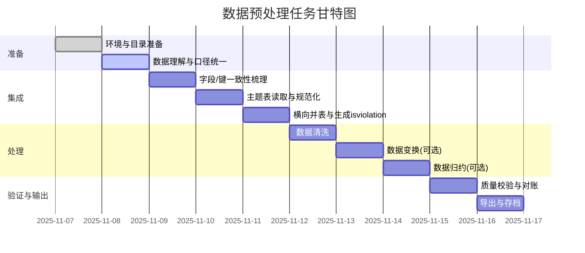

## 财务舞弊识别实验1——数据预处理 任务指导清单与顺序

本清单结合实验背景（舞弊三角理论）、`Dataset/` 各数据表与 `README.md` 汇总要求，给出端到端的数据预处理实施指南、顺序与质量校验要点，并配套 Mermaid 流程/甘特图以便执行与把控。

---

### 0. 环境与目录准备（必须先做）
- 明确工作目录：`C:/Users/jimmy/Desktop/大数据智能分析与理论/`
- 数据位置：`Dataset/`、背景说明：`财务舞弊识别实验1——数据预处理 (1)/内容.txt`
- 输出命名：`组号-preprocessed.csv`（示例：`1-preprocessed.csv`）
- 工具建议：Python 3.9+（pandas、openpyxl）、或等价数据处理工具

质量门槛：能读取全部 Excel 与 DES 文本，能写出 CSV。

---

### 1. 数据理解与口径统一（先读后做）
- 通读 `内容.txt`（舞弊三角：压力/机会/借口）与 `README.md`（字段解释、集成样例列名）。
- 明确主键：`Stkcd`（股票代码）、`Accper`（报告期/年度）、`Typrep`（报表类型）。
- 明确目标变量：`isviolation`，来自 `违规信息总表/`。
- 列口径按 DES 文档：
  - 经营能力（`FI_T4.xlsx`）：`F040101B` … `F041805C`
  - 盈利能力（`FI_T5.xlsx`）：`F050104C` … `F053202B`
  - 发展能力（`FI_T8.xlsx`）：`F080102A` … `F080603A`
  - 偿债能力（`FI_T1.xlsx`）：`F010101A` … `F011201A`
  - 风险水平（`FI_T7.xlsx`）：`F070101B` … `F070301B`
  - 披露财务（`FI_T2.xlsx`）：`F020108`
  - 每股指标（`FI_T9.xlsx`）：`F090102B`
  - 股利分配（`FI_T11.xlsx`）：`F110101B` … `F110801B`

注意：TTM 字段已按 DES 定义给出，优先使用原值，不再重复计算。

---

### 2. 字段与键一致性梳理（映射规则）
- 股票代码对齐（常见差异）：
  - 财务表 `Stkcd` 可能为数值/不补零；违规表 `Symbol` 常为 6 位字符串（如 `000002`）。
  - 建议映射：`symbol_as_int = int(Symbol)`；或 `stkcd_padded = Stkcd.zfill(6)` 与 `Symbol` 匹配，二选一保持一致。
- 年度对齐：
  - 财务表 `Accper` 若为日期（如 `2010-12-31`），取年份 `year(Accper)`；与违规表 `ViolationYear` 对齐。
- 报表类型 `Typrep`：
  - 按集成示例保留原值（K/C/S/H/F/E/N 等）；若同公司同年多版本冲突，采用优先级（建议）：`K > C > S > H > F > E > N`，或依据“合并优先、年报优先”的原则择一。

---

### 3. 数据集成（横向并表）
目标：以 `Stkcd + Year(Accper) + Typrep` 为键，将各主题表的指标横向合并，再补充 `isviolation`。

步骤：
1) 读取各主题 Excel（`FI_T1/T2/T4/T5/T7/T8/T9/T11.xlsx`），仅保留主键与指标列。
2) 规范键：
   - 新增 `Year = year(Accper)`；
   - 统一 `Stkcd` 类型（建议整型或 6 位字符串一致）；
   - 保留/清洗 `Typrep`。
3) 以增量方式 `outer join` 横向合并主题表（避免漏项），冲突字段不应存在（各表字段前缀不同）。
4) 生成 `isviolation`：
   - 读取 `STK_Violation_Main.xlsx`；
   - 将 `Symbol` 与财务侧 `Stkcd` 对齐；
   - 以 `Symbol/Stkcd + ViolationYear/Year` 聚合判断：若该年存在违规记录，`isviolation=1`，否则 `0`。

输出中列顺序建议严格对齐 `集成数据示例.csv`。

---

### 4. 数据清洗（缺失/异常/一致性）
- 缺失统一：将 `NA/NULL/空字符串` 统一为 `NaN`；
- 规则缺失：按 DES 说明，分母为 0 或缺失导致的 NULL 属业务合理缺失，保留为 `NaN`；
- 数值校验：
  - 比率类（如 `资产负债率` 等）应在合理区间（通常 [0, 1] 或业务区间），越界标记为异常；
  - 周转率类应为非负；极端值进行分位数截断（如 1%/99% winsorize）或保留并加异常标记列；
- 类型统一：确保数值列为数值类型、日期列可解析为日期、`isviolation` 为 {0,1} 整型。

---

### 5. 数据变换（可选，视建模需求）
- 标准化/归一化：Z-Score 或 MinMax（记录所用方法与列清单）；
- 变换：对长尾分布（如周转率）可对数化（log1p）；
- 衍生特征（如需要）：与舞弊三角维度聚合的综合得分等（记录公式与可复现性）。

---

### 6. 数据归约（降维与特征选择，可选）
- 方差过滤：移除近似常数特征；
- 相关性过滤：|ρ| > 0.95 的冗余特征保留一个；
- 降维：PCA/ICA（保留解释方差、成分装载矩阵与随机种子）。

---

### 7. 质量校验与业务对账（必须）
- 完整性：样本量与企业-年度覆盖率对比原始合计；
- 一致性：随机抽样核对若干公司某年指标是否与源表一致；
- 合理性：
  - 单位与量纲检查（百分比与小数口径一致性）；
  - 关键约束：如 `收益留存率 = 1 - 股利分配率` 的口径收敛性（按 DES 口径检视）；
- 目标标注：抽查若干违规公司年份的 `isviolation=1` 是否命中。

---

### 8. 导出与存档（必须）
- 列顺序与 `集成数据示例.csv` 对齐；
- 文件名：`组号-preprocessed.csv`；
- 存档：脚本、版本、处理日志（含异常与口径决策）。

---

### 9. 推荐执行顺序（总览流程）

```mermaid
flowchart TD
  A[环境/目录准备] --> B[数据理解与口径统一]
  B --> C[字段/键一致性梳理]
  C --> D[主题表读取与规范化]
  D --> E[横向并表]
  E --> F[违规数据读取与匹配]
  F --> G[生成 isviolation]
  G --> H[数据清洗]
  H --> I[数据变换(可选)]
  I --> J[数据归约(可选)]
  J --> K[质量校验与对账]
  K --> L[导出组号-preprocessed.csv]
```

---

### 10. 任务甘特图（示例排期）



---

### 11. 可操作性清单（Checklist）
- 已验证能读取所有源数据与 DES 文档
- 已统一 `Stkcd` 与 `Symbol` 的匹配口径
- 已将 `Accper` 规范为年份并全表一致
- 已定义 `Typrep` 选择优先级并处理重复
- 已完成主题表的横向合并，字段无冲突
- 已依据违规总表完成 `isviolation` 标注
- 已完成缺失与异常处理并留痕
- 已完成必要的类型/口径一致性检查
- 已通过抽样对账与全表合理性校验
- 已按示例列顺序输出 CSV 并归档处理过程

---

### 12. 输出列模板（与集成示例一致）

Stkcd, Accper, Typrep, isviolation,
F040101B, F040202B, F040203B, F040205C, F040401B, F040503B, F040505C,
F040803B, F040805C, F041203B, F041205C, F041301B, F041403B, F041405C,
F041703B, F041705C, F041803B, F041805C,
F050104C, F050204C, F053201B, F053301C, F052401B, F053202B,
F080102A, F081002B, F082601B, F080603A,
F070101B, F070201B, F070301B,
F090102B, F020108,
F110101B, F110301B, F110801B

---

---

### 13. 缺失指标说明（重要）

根据任务背景要求，以下指标在**当前数据集中缺失**，需要在 taskmap.md 中明确标注：

#### 13.1 机会指标（缺失）

**治理结构类指标**（当前数据集中无对应表）：
- ❌ 董事长与总经理兼任情况（1=同一人；2=不同一人）
- ❌ 四委设立个数（审计委员会、战略委员会、提名委员会、薪酬与考核委员会）
- ❌ 监管层持股比例（董事、监事、高级管理人员持股数/总股数）
- ❌ 国有股比例（国有股股数/总股数）

**股权结构类指标**（当前数据集中无对应表）：
- ❌ 股权集中指标%（公司前10位大股东持股比例之和）
- ❌ Herfindahl_5指数（公司前5位大股东持股比例的平方和）
- ❌ Z指数（公司第一大股东与第二大股东持股比例的比值）

#### 13.2 借口指标（部分存在，部分缺失）

**已存在但未集成**：
- ⚠️ **行业大类（Indcd）**：在偿债能力表（FI_T1.xlsx）中存在 `Indcd [行业代码]` 字段（证监会行业分类2012年版），但当前预处理脚本未提取此字段
  - 建议：在数据预处理阶段提取并集成此字段

**缺失**（当前数据集中无对应字段）：
- ❌ 高管平均教育背景（教育情况平均值）
- ❌ 审计意见类型（分类变量）

#### 13.3 管理层财务状况指标（部分缺失）

**已包含**（在股利分配表 FI_T11.xlsx 中）：
- ✅ 每股税前现金股利（F110101B）
- ✅ 股利分配率（F110301B）
- ✅ 收益留存率（F110801B）

**缺失**（当前数据集中无对应字段）：
- ❌ 管理层持股比例（董事、监事及高级管理人员持股数量/总股数，有兼任情况时不重复计算）
- ❌ 高管持股比例（高级管理人员持股数量/总股数）

#### 13.4 外部压力指标（部分缺失）

**已包含**：
- ✅ 偿债能力指标（FI_T1.xlsx）：流动比率、速动比率、利息保障倍数、现金流量/流动负债、资产负债率
- ✅ 风险水平指标（FI_T7.xlsx）：财务杠杆、经营杠杆、综合杠杆
- ✅ 每股收益（FI_T9.xlsx）：F090102B

**缺失**：
- ❌ 是否被ST（ST标记为1，非ST标记0）

#### 13.5 处理建议

1. **数据预处理阶段**：
   - 当前预处理脚本仅处理**现有数据源**中的指标
   - 缺失指标需要在后续特征工程阶段从外部数据源补充

2. **建模阶段**：
   - 如果无法获取缺失指标，可先使用现有指标进行建模
   - 建议在模型说明中明确标注使用了哪些指标类别，哪些缺失

3. **数据补充建议**：
   - 治理结构数据：可从CSMAR、Wind等数据库获取公司治理相关数据
   - 股权结构数据：可从股东持股明细表计算得出
   - 审计意见：可从年报审计报告部分提取
   - 行业分类：可从公司基本信息表获取
   - ST标记：可从交易所公告或公司基本信息表获取
   - 管理层持股：可从高管持股明细表计算得出

---

**重要说明**：本 taskmap.md 完整覆盖了**当前数据集中所有可用指标**的预处理流程。对于任务背景中提及但数据集中缺失的指标，已在上述章节明确标注，建议在后续特征工程阶段补充。


